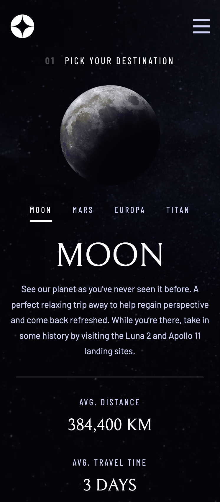
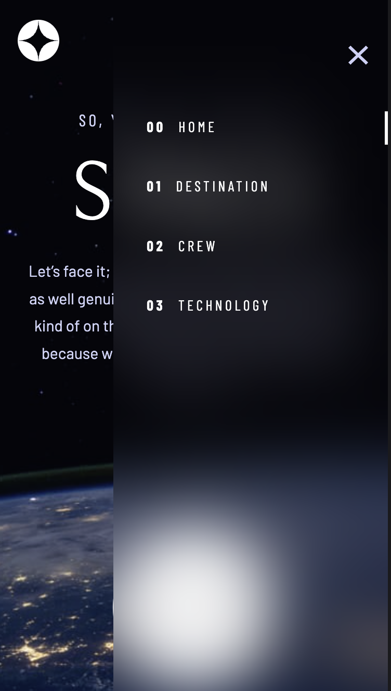
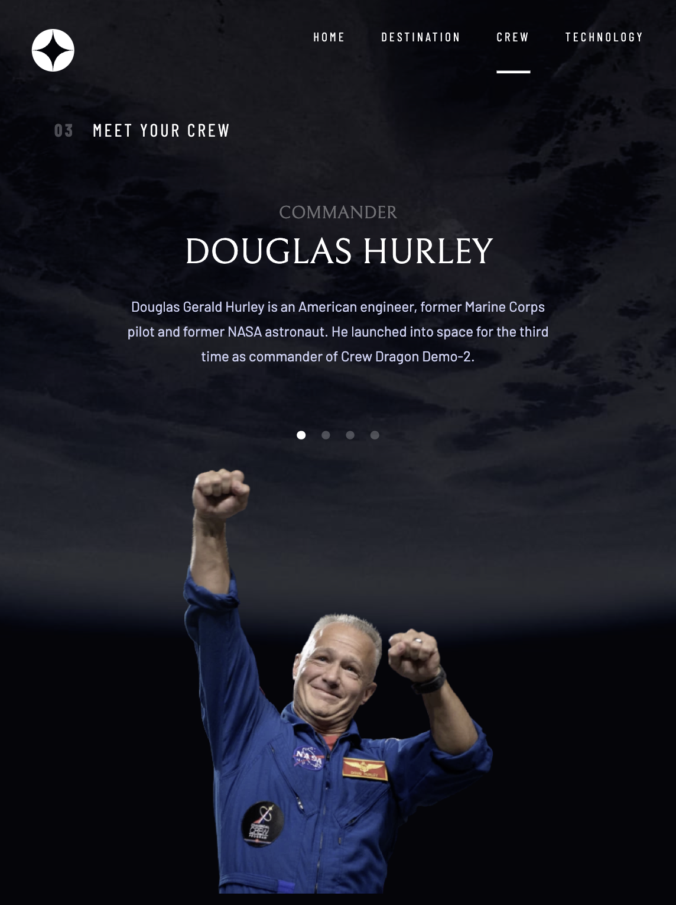
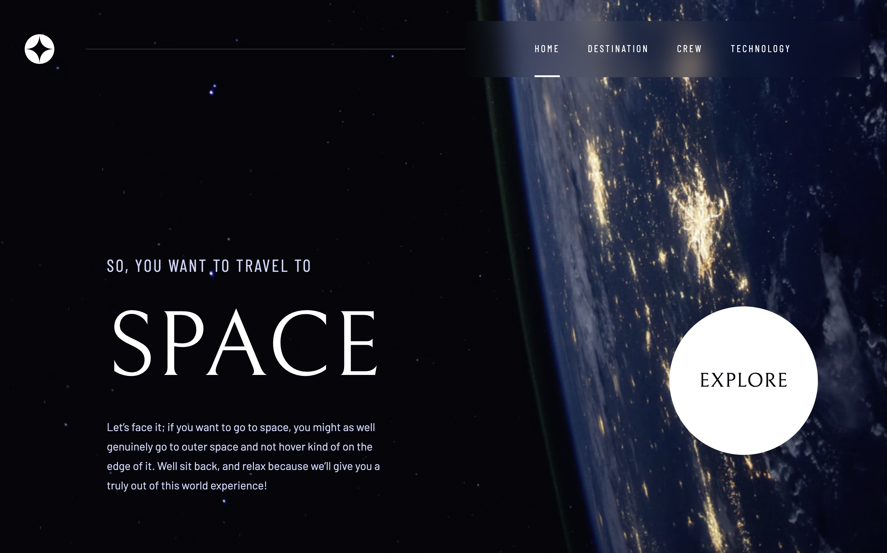

# Frontend Mentor - Space tourism website solution

This is a solution to the [Space tourism website challenge on Frontend Mentor](https://www.frontendmentor.io/challenges/space-tourism-multipage-website-gRWj1URZ3). Frontend Mentor challenges help you improve your coding skills by building realistic projects. 

## Table of contents

- [Overview](#overview)
  - [The challenge](#the-challenge)
  - [Screenshot](#screenshot)
  - [Links](#links)
- [My process](#my-process)
  - [Built with](#built-with)
  - [What I learned](#what-i-learned)
  - [Continued development](#continued-development)
  - [Useful resources](#useful-resources)
- [Author](#author)
- [Acknowledgments](#acknowledgments)

## Overview

### The challenge

Users should be able to:

- View the optimal layout for each of the website's pages depending on their device's screen size
- See hover states for all interactive elements on the page
- View each page and be able to toggle between the tabs to see new information

### Screenshot

### Links

- Solution URL: [GitHub Page](https://github.com/MCDoodle1/space-tourism)
- Live Site URL: [Space Tourism Site](https://mcdoodle1.github.io/space-tourism/)

## My process

I first examined the page layout of the different versions (mobile, tablet and desktop) and divided it into sections. These sections became the basis for the React components (Navbar, Hero, Title, etc.). From this I decided to use CSS Grids. I viewed the Scrimba training by Kevin Powel and created the basic CSS styling. Then I styled every component with the help of the Figma file from the course. After this I added the functionality with React JS and tweeked the styling.

### Built with

- CSS custom properties
- CSS Grid
- Flexbox
- Mobile-first workflow
- Responsive design
- [React](https://reactjs.org/) - JS library

### What I learned

I learned a lot of new CSS from the course and used the Router/Navlink component in React. I also learned to use UseLocation and created a custom hook.

It was quite a challenge to deploy the code on GitHub pages. I had to change the router
from BrowserRouter to HashRouter for the navigation to work.

### Continued development

Extend my knowledge of HTML, CSS and React.

### Useful resources

- [Build a Space Travel Website](https://scrimba.com/learn/spacetravel) - Scrimba course by Kevin Powel in collaboration with FrontendMentor
- [React Router](https://reactrouter.com/en/main) - Manual for React Router
- [Create React App Dev](https://create-react-app.dev/docs/deployment/) - Manual to publish a React app on GitHub Pages
- [spa-github-pages](https://github.com/rafgraph/spa-github-pages) - Manual to use BrowserRouter on GitHub Pages
- [StackOverflow](https://stackoverflow.com/) - Can't do without

## Author

- Website - [Marco Clarijs](https://github.com/MCDoodle1)
- Frontend Mentor - [@MCDoodle1](https://www.frontendmentor.io/profile/MCDoodle1)